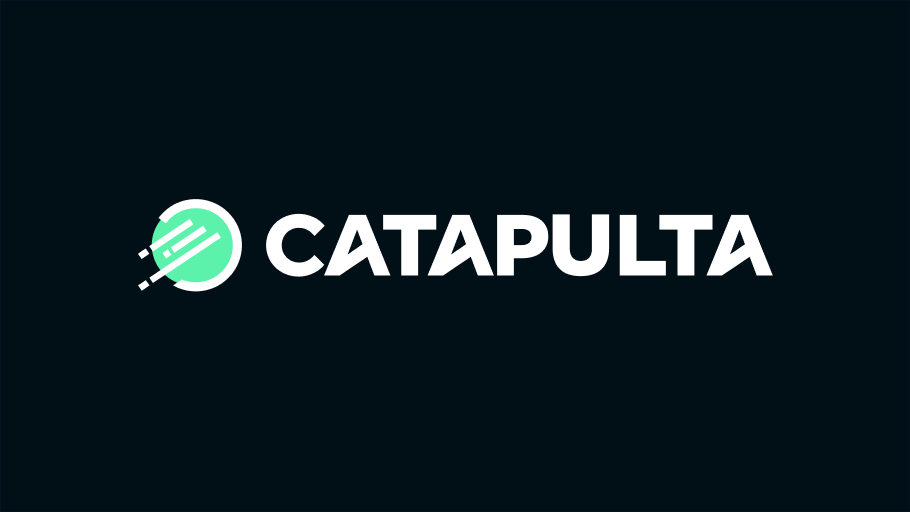

<h1 align="center">
  
</h1>

<h3 align="center">
  Finclass clone, Mobile App
</h3>

<blockquote align="center">“Mude você e todo o resto mudará naturalmente”!</blockquote>

  <a href="#-tecnologias">Tecnologias</a>&nbsp;&nbsp;&nbsp;|&nbsp;&nbsp;&nbsp;
  <a href="#-projeto">Projeto</a>&nbsp;&nbsp;&nbsp;|&nbsp;&nbsp;&nbsp;
  <a href="#-instalação-e-execução">Instalação e execução</a>&nbsp;&nbsp;&nbsp;|&nbsp;&nbsp;&nbsp;
  <a href="#-licença">Licença</a>

 

## 🚀 Tecnologias

Esse projeto foi desenvolvido com as seguintes tecnologias:

- 
- 
- 

## 💻 Projeto

O Finclass é um clone do app original, desenvolvido pela Catapulta com o intuito de compartilhar conhecimento com a comunidade. 

## 📥 Instalação e execução

Faça um clone desse repositório

- Pre running (Android|Ios)
  - run `yarn i`
- IOS:
  - run `yarn ios`
- Android:   
  - run `yarn android`

## 👨‍💻 Desenvolvido

Armando Arlan Joergensen 

## 📝 Licença

Esse projeto está sob a licença MIT. Veja o arquivo [LICENSE](LICENSE.md) para mais detalhes.
